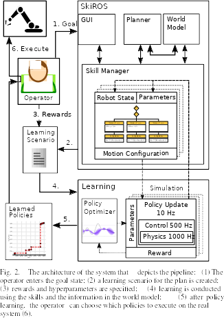

# Architecture

The paper includes a nice overview of how different components in SkiREIL interact.

## Communication with SkiROS
In the above architecture, the dotted arrows between Skill Manager and learning components represent communication during learning.
There are two important `.srv` message definition files that we can look at to understand this communication.
They are located at `srv/*.srv`.

* `ManageSkirosWorker.srv` is used for requesting and releasing SkiROS workers.
	This enables the parallel and somewhat independent execution of SkiROS tasks, i.e. the parallel existence and ticking of the respective behavior tree. Each simulation gets an own skill manager assigned. This message is used to assign and release them.
	+ In SkiROS, all of these workers have their own SkiROS task with an own blackboard, but they all share the same world model.
	To update world-model-like information per Task, the blackboard is used instead of the world model itself.
* `SkirosNextAction.srv` is used for for the communication to SkiROS during an episode (request and response!).
	This is the very core of the connection between dart and SkiROS: at every RL timestep (often 100ms), the updated state of the simulation is written to the SkiROS worker's blackboard. Based on that new information, the SkiROS behavior tree is ticked and re-evaluated, resulting in updated commands (i.e. the BT might activate a different motion).
	The updated commands are returned to the simulation including a feedback signal if the BT has succeeded.

## Important files
* `config/*.json`: these are config files to configure experiments. Configure things like which robots to run, which reward functions to use.
* `include/skireil/experiments/learning_skills.hpp`: parses json config files. Sets up logging. Initializes scenes and parameters. If you add a non-existing field in a json, you'll have to add it here too.
* `include/skireil/experiments/learning_skills_robots.hpp`: where the robots are defined. Mostly refering to the right URDF file. Also see the tutorial on [adding your own robot](add_your_own_robot.md).
* `include/skireil/experiments/learning_skills_scenes.hpp`: where scenes are defined.
* `include/skireil/reward/reward_functions.hpp`: where the reward functions are defined. Also see the tutorial on defining [your own reward function](make_your_own_reward.md).
* `include/skireil/skireil.hpp`: the algorithm
* `include/skireil/policy/skiros_policy.hpp`: communication with SkiROS
